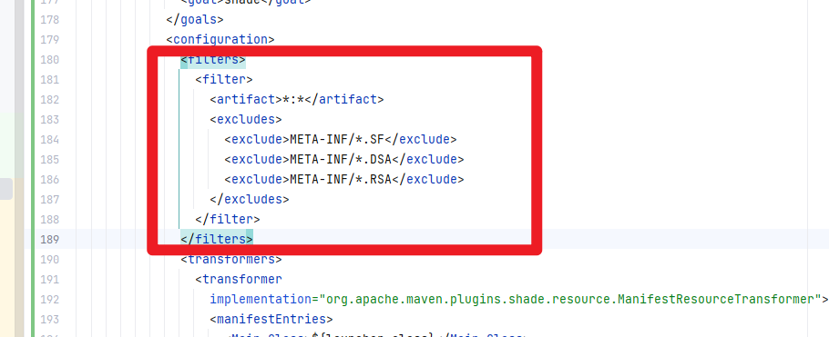
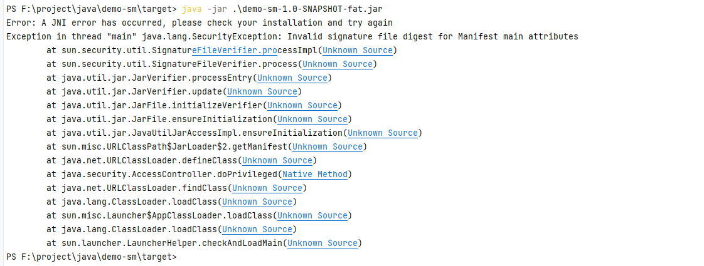

##### 打包时一定要加上这个，不然运行时报错

```xml
<filters>
  <filter>
    <artifact>*:*</artifact>
    <excludes>
      <exclude>META-INF/*.SF</exclude>
      <exclude>META-INF/*.DSA</exclude>
      <exclude>META-INF/*.RSA</exclude>
    </excludes>
  </filter>
</filters>
```



